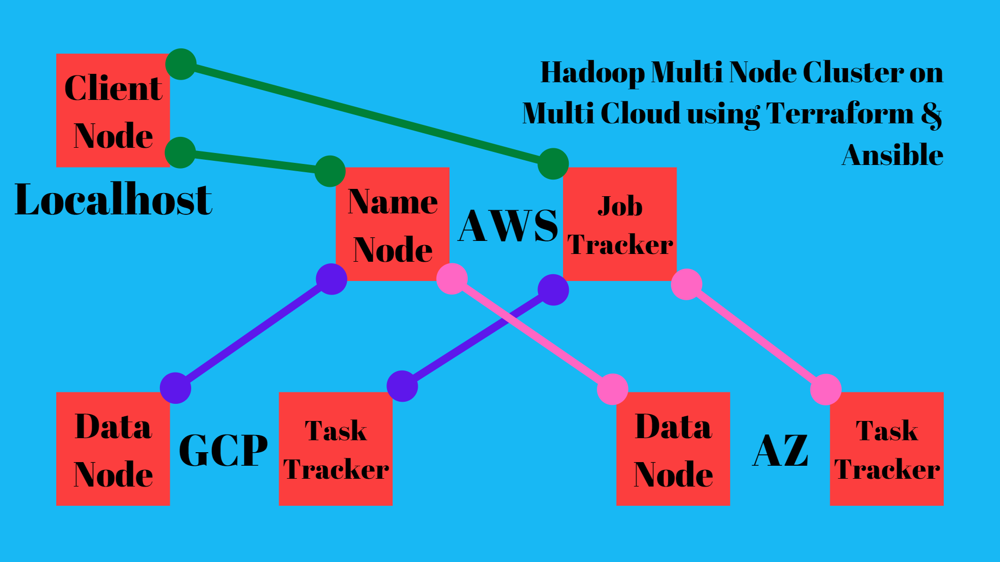

### This project is an integration of different tools & technologies like AWS, Azure, GCP, Hadoop, Terraform, Ansible etc.
#### To see the practical demonstration follow the link : https://youtu.be/VB1jECOcJAk
#### Project Description :
##### Setting up Multi Node Hadoop HDFS & MR cluster on Multi Cloud. Here we are setting up total 6 instances across all three cloud. On AWS we are setting up NameNode & JobTracker. On GCP & Azure we are setting up DataNode & TaskTracker. On local node we are setting up Hadoop Client & then installing pig & hive software to work on our cluster. Refer to the below diagram to understand the infrastructure.

